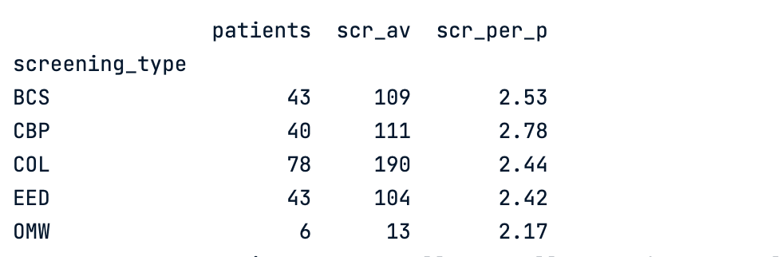
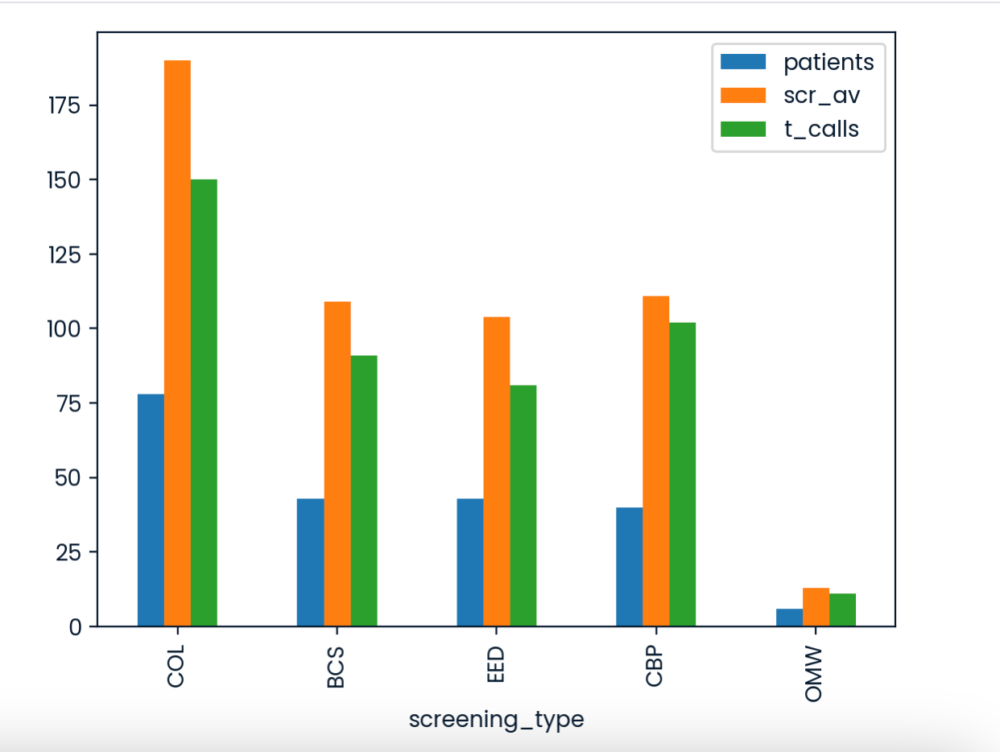
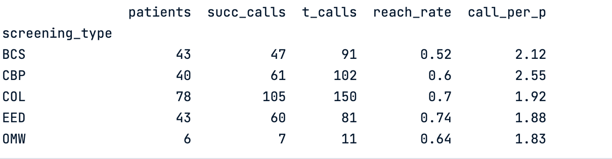
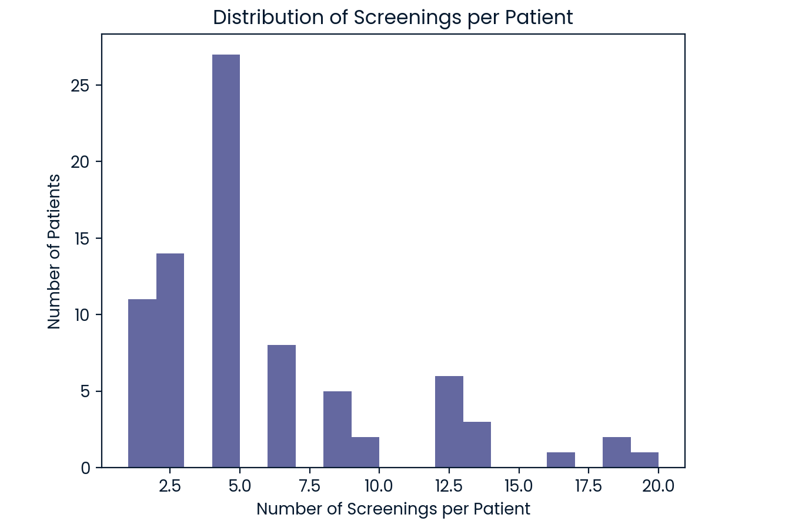
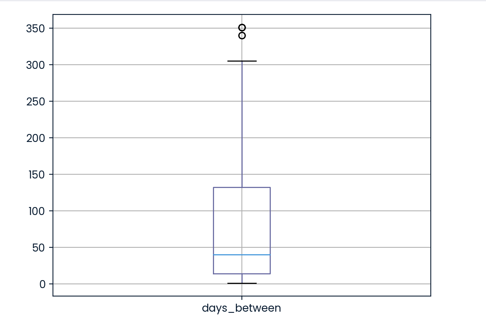

# NURSE OUTREACH CAMPAIGN

About Universal Healthy Humans Company: 

As a partially government-funded healthcare company, Universal Healthy Humans Company (UHHC) is accountable for the screening compliance rate of its customers. To support customers in completing required annual healthcare screenings, UHHC operates an outbound call centre staffed by nurses who are tasked with making contact with customers who have not completed their required screenings and supporting them in understanding the importance of and gaining access to resources to complete their screenings. Preventive Screening Outreach via Phone Our clinic runs a targeted outreach initiative to boost participation in preventive health screenings for patients over the age of 50. While digital and print communications have their place, we focused exclusively on personal phone calls to increase patient engagement and trust. 

The initiative prioritised five critical screening areas: 
bowel cancer (BCS), colorectal cancer (COL), controlling high blood pressure (CBP), osteoporosis management in women (OMW), and early elective delivery prevention (EED). 

A member of the clinical staff called each patient to: 
- Explain why the screening was recommended 
- Address any concerns or misconceptions 
- Help schedule necessary appointments or follow-ups 

Each call lasted approximately 15 to 20 minutes, allowing time for a two-way conversation and ensuring the patient felt informed and supported.

The company wanted to increase preventive screening compliance among patients and was interested in whether their outbound effort was successful.

**3 main questions**:

- Did patients tend to be more compliant (aka completed screenings they were offered) after the nurse team called them?
- Were there differences in compliance depending on how many screenings a patient was eligible for?
- Based on the data, how should they optimise the outbound calls to maximise compliance?

The Outbound Call Nurse team has provided some data about their phone call activity, patient screening eligibility and compliance activity in a csv file.

The data hasn’t been validated.

The project is subdivided into 3 pain parts:
- data cleaning and validation
- EDA
- Summary and business recommendations

Tech stack: Python (Pandas, Matplotlib, Seaborn, NumPy), Jupyter notebook.

## **Data Validation and Cleaning**
- [Initial dataframe](https://github.com/elenaEro/data-analyst-porfolio/blob/main/outreach-analysis-healthcare/assets/initial_df_outreach.png):
- [Cleaned dataframe](https://github.com/elenaEro/data-analyst-porfolio/blob/main/outreach-analysis-healthcare/assets/cleaned_df_outreach.png):

After a quick investigation, we can see that all the columns are object-type. Also, the data frame consists of duplicate rows where values in each and every column are identical.

First step, I deleted all the duplicates.

Column 'patient_id':

Although the values consist exclusively of numeric characters and have a fixed length of 22 digits, they were intentionally retained as an object (string) data type rather than being converted to a numeric type. Explanation(reasons): The 22-digit identifiers exceed the maximum value supported by standard 64-bit integers (int64). Converting these values to a numeric type would result in overflow or loss of precision, compromising data integrity. This column serves as an identifier and doesn't represent any arithmetic measure; no arithmetic operations, aggregations, or numerical comparisons are expected to be performed on this column. It's a best practice to store identifiers in a database as categorical or string types. Also, I used str.strip() to ensure the identical format for all values in the column

Column 'screening_type':

After a brief inspection, an unexpected value was found and deleted from the dataframe('A1C'). The data type is kept as an object.

Column 'screening_completed_ind':

As this project focuses on the patients assigned to any of the screening types, we won't use information about patients with ineligible screenings. Therefore, all the NA values were dropped from the column before casting. For this column, we have additional value; 's'. I interpreted it as success, so 's' should be converted to True value in a boolean data type. I used my custom function for this column according to the unique values this column includes.

Columns 'screening_date' and 'latest_call_date':

As both of the columns need to be changed to the datetime type with the same format “YYYY-MM-DD”, I subset these 2 columns from the dataframe and used apply() to cast both of the columns at the same time to the datetime. I also specified that I needed a format without the time of the day, only year, month and day. I also specified errors='coerce' to add NaT for the values where there is an error in the date, or data is missing. (It's important for the 'latest_call_date' column as there is missing data)

Column 'reached_ind':

Unique values of reached_ind: ['0.0' nan '1.0' '1 and reached']. To standardise values and convert them into a boolean data type, I used a custom function, which mapped '1.0', '1 and reached' values to True, '0.0' to False and kept NA in the dataframe as we'll use them to calculate business metrics.

## **North-star metrics and EDA**:

**North-star metrics for this project**:

- **Reach rate**: total successful calls(when patient was reached)/total call attempts; this metric will help to evaluate time/money spent on the outreach company.
- **Outreach Uplift**: the difference in compliance rate between reached and not reached patients;
- **Patient-Level Compliance Rate**: all completed screening by patient/total eligible screening for patient; metric ranges from 0 to 1, and we will look at whether different treatments change the compliance rate for different groups of patients.
- **Fully-compliant patients**(total, percentage); this metric supports the first one and helps to analyse the compliance level on the behavioural level. 

In some cases, we will also use a supportive metric:
- **Screening-Level Compliance rate**: total finished screenings/total evaluable screenings in per cent;

## **EDA**

### How data was collected

Screening period: 2024-02-04 00:00:00 to 2025-01-13 00:00:00
Call period: 2024-01-01 00:00:00 to 2024-12-16 00:00:00
The cases where the screening_date was earlier than the latest_call_date are not found.

### How patients were assigned to the screenings

The patients were assigned to different screening types in different proportions: the most significant group consists of 78 patients for colorectal cancer (COL), which is approximately twice as large as the three other groups — bowel cancer (BCS), controlling high blood pressure (CBP), and early elective delivery prevention (EED), each containing around 40 patients. There are only 6 patients in the osteoporosis management in women (OMW) group, which is notably small and may limit the reliability of any conclusions drawn from this group. 
The number of available screenings per patient varies across groups, ranging from approximately 2.17 to 2.78 screenings per patient.

These imbalances in group sizes can significantly affect the compliance rate and patient behaviour. For example, cancer-related screenings tend to generate higher levels of patient anxiety, which may influence compliance differently compared to non-cancer screenings. 

Also, the amount of total calls made(t_calls) and screenings available (scr_av) is higher for colorectal cancer and has the highest impact on the data.

The reach rate differs depending on the screening type, from 0.52 to 0.74. It is also noteworthy that groups with a higher reach rate tend to have fewer calls per person (call_per_p); this pattern requires further statistical testing before concluding.

### Distribution of screenings per patient

After aggregating data on the patient level, we see that there were a total of 80 patients in the outreach program. 
The eligible screening for one particular patient could vary from 1 to 19. Keeping in mind that the screening period was around 12 months, it is 1-2 screenings each month for the whole year. Half of the patients were eligible for up to 4 screenings within 1 year, and 75% patients for up to 6.5 screenings.

This raises the question about the optimal number of screenings eligible per patient.

### Were there patients who were assigned for the same screening several times and didn't complete it?

18 patients were assigned and didn't complete the same screening at least 2 times. 
Overall, there were 41 cases when a patient was assigned and didn't complete the same screening type. I tactually means that each of the 18 patients was assigned an average of 2 different screenings, and none of them was completed.

### How was the outreach designed

To analyse the style of outreach, the days between the outreach call and the screening were calculated for each screening.
The interval varies from 1 to 351 days (almost a year). 25% were contacted within 2 weeks before the screening, half of the patients were contacted up to 40 days before the screening, and the other half from 40 to 351 days prior. In terms of common sense, it may be worth fixing the interval between last call and the screening date for up to 30-40 days as people tend to forget about the information for such a long time.

### Reach rate and outreach uplift

