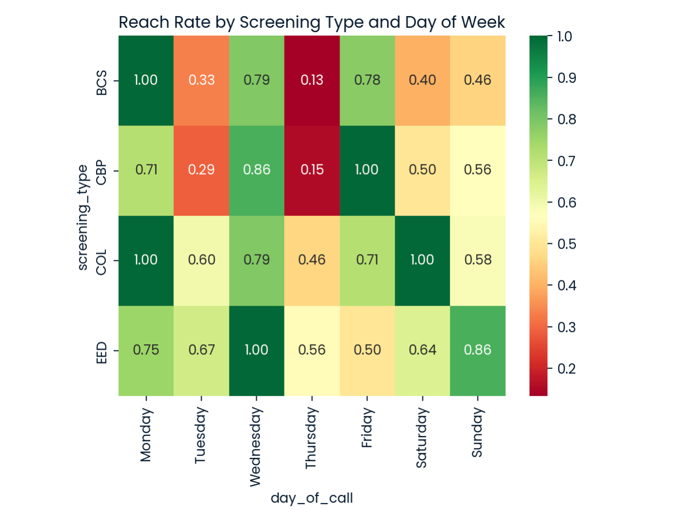
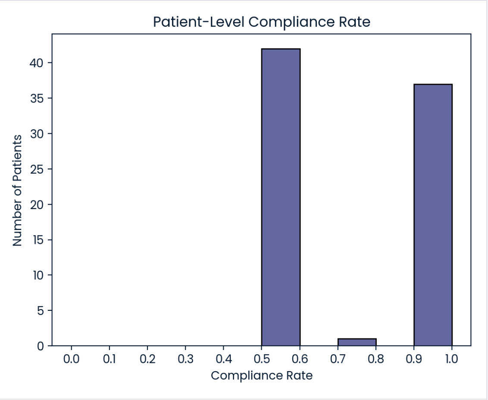

# NURSE OUTREACH CAMPAIGN

About Universal Healthy Humans Company: 

As a partially government-funded healthcare company, Universal Healthy Humans Company (UHHC) is accountable for the screening compliance rate of its customers. To support customers in completing required annual healthcare screenings, UHHC operates an outbound call centre staffed by nurses who are tasked with making contact with customers who have not completed their required screenings and supporting them in understanding the importance of and gaining access to resources to complete their screenings. Preventive Screening Outreach via Phone Our clinic runs a targeted outreach initiative to boost participation in preventive health screenings for patients over the age of 50. While digital and print communications have their place, we focused exclusively on personal phone calls to increase patient engagement and trust. 

The initiative prioritised five critical screening areas: 
bowel cancer (BCS), colorectal cancer (COL), controlling high blood pressure (CBP), osteoporosis management in women (OMW), and early elective delivery prevention (EED). 

A member of the clinical staff called each patient to: 
- Explain why the screening was recommended 
- Address any concerns or misconceptions 
- Help schedule necessary appointments or follow-ups 

Each call lasted approximately 15 to 20 minutes, allowing time for a two-way conversation and ensuring the patient felt informed and supported.

The company wanted to increase preventive screening compliance among patients and was interested in whether their outbound effort was successful.

**3 main questions**:

- Did patients tend to be more compliant (aka completed screenings they were offered) after the nurse team called them?
- Were there differences in compliance depending on how many screenings a patient was eligible for?
- Based on the data, how should they optimise the outbound calls to maximise compliance?

The Outbound Call Nurse team has provided some data about their phone call activity, patient screening eligibility and compliance activity in a csv file.

The data hasn’t been validated.

The project is subdivided into 3 main parts:
- data cleaning and validation
- EDA
- Summary and business recommendations

Tech stack: Python (Pandas, Matplotlib, Seaborn, NumPy), Jupyter notebook.

## **Data Validation and Cleaning**
- [Initial dataframe](https://github.com/elenaEro/data-analyst-porfolio/blob/main/outreach-analysis-healthcare/assets/initial_df_outreach.png)
- [Cleaned dataframe](https://github.com/elenaEro/data-analyst-porfolio/blob/main/outreach-analysis-healthcare/assets/cleaned_df_outreach.png)

After a quick investigation, we can see that all the columns are object-type. Also, the data frame consists of duplicate rows where values in each and every column are identical.

First step, I deleted all the duplicates.

Column 'patient_id':

Although the values consist exclusively of numeric characters and have a fixed length of 22 digits, they were intentionally retained as an object (string) data type rather than being converted to a numeric type. Explanation(reasons): The 22-digit identifiers exceed the maximum value supported by standard 64-bit integers (int64). Converting these values to a numeric type would result in overflow or loss of precision, compromising data integrity. This column serves as an identifier and doesn't represent any arithmetic measure; no arithmetic operations, aggregations, or numerical comparisons are expected to be performed on this column. It's a best practice to store identifiers in a database as categorical or string types. Also, I used str.strip() to ensure the identical format for all values in the column

Column 'screening_type':

After a brief inspection, an unexpected value was found and deleted from the dataframe('A1C'). The data type is kept as an object.

Column 'screening_completed_ind':

As this project focuses on the patients assigned to any of the screening types, we won't use information about patients with ineligible screenings. Therefore, all the NA values were dropped from the column before casting. For this column, we have additional value; 's'. I interpreted it as success, so 's' should be converted to True value in a boolean data type. I used my custom function for this column according to the unique values this column includes.

Columns 'screening_date' and 'latest_call_date':

As both of the columns need to be changed to the datetime type with the same format “YYYY-MM-DD”, I subset these 2 columns from the dataframe and used apply() to cast both of the columns at the same time to the datetime. I also specified that I needed a format without the time of the day, only year, month and day. I also specified errors='coerce' to add NaT for the values where there is an error in the date, or data is missing. (It's important for the 'latest_call_date' column as there is missing data)

Column 'reached_ind':

Unique values of reached_ind: ['0.0' nan '1.0' '1 and reached']. To standardise values and convert them into a boolean data type, I used a custom function, which mapped '1.0', '1 and reached' values to True, '0.0' to False and kept NA in the dataframe as we'll use them to calculate business metrics.

## **North-star metrics and EDA**:

**North-star metrics for this project**:

- **Reach rate**: total successful calls(when patient was reached)/total call attempts; this metric will help to evaluate time/money spent on the outreach company.
- **Outreach Uplift**: the difference in compliance rate between reached and not reached patients;
- **Patient-Level Compliance Rate**: all completed screening by patient/total eligible screening for patient; metric ranges from 0 to 1, and we will look at whether different treatments change the compliance rate for different groups of patients.
- **Fully-compliant patients**(total, percentage); this metric supports the first one and helps to analyse the compliance level on the behavioural level. 

In some cases, we will also use a supportive metric:
- **Screening-Level Compliance rate**: total finished screenings/total evaluable screenings in per cent;

## **EDA**

### How data was collected

Screening period: 2024-02-04 00:00:00 to 2025-01-13 00:00:00
Call period: 2024-01-01 00:00:00 to 2024-12-16 00:00:00
The cases where the screening_date was earlier than the latest_call_date are not found.

### How patients were assigned to the screenings

The patients were assigned to different screening types in different proportions: the most significant group consists of 78 patients for colorectal cancer (COL), which is approximately twice as large as the three other groups — bowel cancer (BCS), controlling high blood pressure (CBP), and early elective delivery prevention (EED), each containing around 40 patients. There are only 6 patients in the osteoporosis management in women (OMW) group, which is notably small and may limit the reliability of any conclusions drawn from this group. 
The number of available screenings per patient varies across groups, ranging from approximately 2.17 to 2.78 screenings per patient.

These imbalances in group sizes can significantly affect the compliance rate and patient behaviour. For example, cancer-related screenings tend to generate higher levels of patient anxiety, which may influence compliance differently compared to non-cancer screenings. 

Also, the amount of total calls made(t_calls) and screenings available (scr_av) is higher for colorectal cancer and has the highest impact on the data.

The reach rate differs depending on the screening type, from 0.52 to 0.74. It is also noteworthy that groups with a higher reach rate tend to have fewer calls per person (call_per_p); this pattern requires further statistical testing before concluding.

### Distribution of screenings per patient

After aggregating data on the patient level, we see that there were a total of 80 patients in the outreach program. 
The eligible screening for one particular patient could vary from 1 to 19. Keeping in mind that the screening period was around 12 months, it is 1-2 screenings each month for the whole year. Half of the patients were eligible for up to 4 screenings within 1 year, and 75% patients for up to 6.5 screenings.

This raises the question about the optimal number of screenings eligible per patient.

### Were there patients who were assigned for the same screening several times and didn't complete it?

18 patients were assigned and didn't complete the same screening at least 2 times. 
Overall, there were 41 cases when a patient was assigned and didn't complete the same screening type. I tactually means that each of the 18 patients was assigned an average of 2 different screenings, and none of them was completed.

### How was the outreach designed

To analyse the style of outreach, the days between the outreach call and the screening were calculated for each screening.
The interval varies from 1 to 351 days (almost a year). 25% were contacted within 2 weeks before the screening, half of the patients were contacted up to 40 days before the screening, and the other half from 40 to 351 days prior. In terms of common sense, it may be worth fixing the interval between last call and the screening date for up to 30-40 days as people tend to forget about the information for such a long time.

A Chi-square test of independence (χ² = 65.04, p < 0.0001) confirms that **the day of the week when patients are contacted** has a statistically significant effect on the **reach rate**.

Analysis of the standardised residuals identifies **Thursday and Monday** as the strongest contributors to this effect:

- **Thursday** shows the largest deviation from expected values (residuals: succ_calls = -3.07, unsucc_calls = +4.12), indicating significantly fewer successful calls and more unsuccessful calls than expected. With only a 33.8% reach rate across 65 calls, Thursday is clearly the worst day for outreach.
- **Monday** shows the opposite pattern (residuals: succ_calls = +2.11, unsucc_calls = -2.84), with a 86.4% reach rate, making it the most effective day for outreach. Both residuals cross the significance threshold of 2.
- **Wednesday** shows a similar positive pattern to Monday (reach rate 84.4%), with residuals just below the threshold of 2 (1.99 and -2.68), suggesting a strong but marginally significant trend.
- **Tuesday** shows a negative trend (reach rate 44.4%) with residuals of -1.67 and +2.24 — the unsuccessful calls residual crosses the threshold, indicating more unsuccessful calls than expected.
- Friday and Saturday show moderate positive reach rates (81.8% and 73.7%) but residuals below 2, so no statistically notable deviation. Sunday has the highest call volume (131 calls) but a moderate reach rate of 59.5%, with residuals close to zero — performing broadly as expected.

### Reach rate

The outreach campaign targeted **80 unique patients**, of whom **56 (70%)** were successfully reached at least once.

At the call level, the overall **reach rate was 64.37%**, representing 280 successful calls out of all call attempts. 
**This rate varies significantly across screening types, ranging from 52% (BCS) to 74% (EED)**, indicating that outreach effectiveness is not uniform across different screening programmes.
This means that on average, **approximately 1 in 3 calls** did not result in successful patient contact, representing a **considerable proportion of nurse time and resources** spent on unsuccessful attempts.

To evaluate whether the reach rate differed significantly across screening types, a Chi-square test of independence was applied to the contingency table of successful and unsuccessful calls per screening type. This test was chosen because the outcome variable (reached/not reached) is binary, and we are comparing proportions across multiple independent groups with unequal sample sizes. The OMW group was excluded from this analysis due to an insufficient sample size (7 successful, 4 unsuccessful calls), which violates the Chi-square assumption of at least 5 observations per cell.

The test returned a chi-square statistic of 12.75 and a p-value of 0.0052, which is well below the 0.05 significance threshold. This indicates that the differences in reach rate across screening types are statistically significant and are unlikely to be due to chance.

To identify which screening types contributed most to this result, standardised residuals were analysed. Residuals with an absolute value above 2 are considered statistically notable. The analysis revealed two main contributors:

**BCS (Bowel Cancer Screening)** showed **fewer successful calls and more unsuccessful calls** than expected, indicating a consistently lower-than-average reach rate. This group is **the most problematic from an outreach perspective** and may require a revised contact strategy. Logging in the time of calls also may help to analyse the most effective tactics for outreach campaign.
**EED (Early Elective Delivery)** showed a positive trend in reach rate: **more successful calls and fewer unsuccessful calls** than expected; however, with residuals of 1.09 and -1.46, both below the significance threshold of 2, this pattern is not statistically confirmed and should be treated as a weak trend only. More data collection is recommended.

**CBP and COL** showed residuals close to zero, suggesting their reach rates are broadly in line with the overall average and do not deviate significantly from what would be expected.

### Reach rate by day of the call and the screening type

Zooming into the heatmap on differences in reach rate among different week days and different screening types for BCS specifically:
Thursday's reach rate drops to just 13% — extremely low
Tuesday's reach rate is 33% — also notably poor

**Both align with the overall pattern but are more pronounced in BCS than other screening types**. This supports the hypothesis that the choice of the reach day aligned with the poor outreach rate.

### Compliance rate and fully-compliant patients

At the patient level, the mean compliance rate across all 80 targeted patients was 67.6%. There were 37 fully-compliant patients overall.

The distribution of compliance rates is bimodal. Patients clustered predominantly at either 0.5 or 1.0, with very few values in between.

This discrete pattern is likely driven by two factors identified during data cleaning:
- Patients were repeatedly scheduled for the same screening types. 
18 patients had multiple incomplete records for the same screening types, meaning they were assigned the same screening several times and did not attend all appointments. Patients scheduled multiple times but attending only some appointments naturally produce mid-range compliance values around 0.5.
Patients who completed all their assigned appointments, regardless of how many times they were scheduled, cluster at 1.0, representing fully compliant behaviour.

This bimodal distribution was visually confirmed as non-normal, which informed the choice of non-parametric testing for all subsequent statistical comparisons of compliance rates between groups.

### Reached vs not reached patients:

To evaluate whether nurse outreach influenced full compliance, statistical comparisons were conducted at two 
Overall comparison across all screening types was run using a Chi-square test on the contingency table of reached/not reached vs compliant/not compliant patients. Second, to account for potential differences between screening types, the same comparison was repeated within each screening type separately (BCS, CBP, COL, EED), with OMW excluded due to insufficient cell counts. Bonferroni correction was applied across the four screening types (adjusted α = 0.0125) to control for multiple comparisons.
Results: No statistically significant difference in full compliance was found between reached and not reached patients — neither at the overall level nor within any individual screening type after Bonferroni correction. This is consistent with the compliance rate findings in Section 1 and further supports the conclusion that the current outreach approach did not drive meaningful behavioural change in this dataset.

### Did outreach improve compliance?

To answer this question robustly, compliance was measured in four different ways: at patient level and at individual screening appointment level, both as a continuous rate and as a binary fully compliant flag, comparing reached and not reached patients within each screening type. The OMW group was excluded due to small sample size. Statistical significance was assessed using Chi-square and Mann-Whitney U tests with Bonferroni correction applied across four screening types.

Across all four approaches, no statistically significant difference was found between patients who were reached by the nurse team and those who were not. This consistent result across multiple analytical methods strengthens the conclusion: **the current outreach campaign did not produce a measurable improvement in screening compliance**.

### Days between last call and screening

Based on the data distribution, four time bins were defined to reflect meaningful intervals: 0-14 days(25th percentile), 15-40 days(50th), 41-90 days(75th), and 90+ days before the screening.

Compliance rates by time bin were as follows:
0-14 days  64.3%
15-40 days 78.7%
41-90 days 60.0%
90+ days 65.7%

A Chi-square test found **no statistically significant difference** in compliance across time bins (chi-square = 8.84, p = 0.065). 
However, the result approaches significance, and the pattern is notable. 
Patients called **15-40 days** before their screening showed the highest compliance rate (78.7%), with a standardised residual of -2.03 for non-compliant patients. Tjis is the only residual approaching the significance threshold of 2, indicating that this group had meaningfully fewer non-completions than expected.

The 41-90 day group showed the opposite trend, with the lowest compliance rate (60.0%), suggesting that calls made too far in advance may be counterproductive, as patients are likely to forget both the call and the upcoming screening.

While the overall result does not reach statistical significance, the directional pattern is consistent and practically meaningful. Combined with the observation that the largest group (140 patients, 32% of all calls) were contacted more than 90 days before their screening, this suggests that standardising outreach calls to within 15-40 days of the screening date could be a low-cost and actionable intervention worth testing in a redesigned study.

## SUMMARY AND BUSINESS RECOMMENDATIONS

